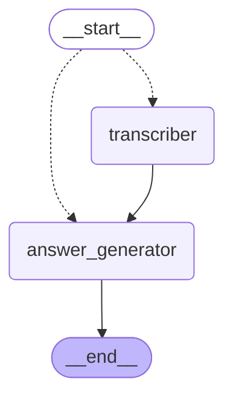

# Agent Graph

```mermaid
graph TD;
	__start__([<p>__start__</p>]):::first
	answer_generator(answer_generator)
	transcriber(transcriber)
	__end__([<p>__end__</p>]):::last
	__start__ -.-> answer_generator;
	__start__ -.-> transcriber;
	transcriber --> answer_generator;
	answer_generator --> __end__;
	classDef default fill:#f2f0ff,line-height:1.2
	classDef first fill-opacity:0
	classDef last fill:#bfb6fc
```
