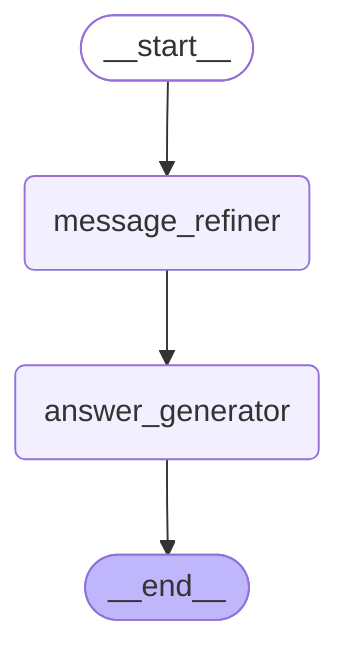

# Agent Graph

## Descrição do fluxo

O grafo segue um fluxo sequencial com dois nós:

1. **`message_refiner`** — se `request_type == "audio"`, transcreve o áudio para texto via Whisper. Em seguida, refina a mensagem (corrige erros ortográficos e fonéticos) usando um agente LLM. Se `request_type == "text"`, apenas refina o texto recebido.
2. **`answer_generator`** — recebe a pergunta refinada e gera a resposta final.

