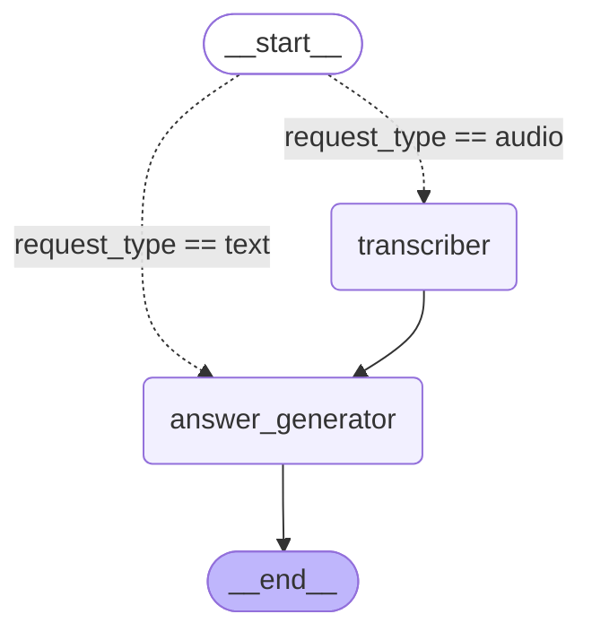

# Agent Graph

## Descrição do fluxo

O grafo utiliza um router condicional no início que verifica o `request_type`:

- **`request_type == "audio"`** → direciona para o `transcriber`, que transcreve o áudio e corrige erros ortográficos fonéticos, depois encaminha o resultado para o `answer_generator`.
- **`request_type == "text"`** → direciona diretamente para o `answer_generator`.

